# Unified Team Topology + AI Integration Roadmap

## Overview

This comprehensive roadmap combines the systematic organizational assessment from the [Team Topology Assessment Toolkit](https://github.com/emarion1/team-topology-assessment) with AI-enhanced Agile transformation to create a complete organizational transformation approach.

## Pre-Implementation: Readiness Assessment

### Assessment Scope
**Target Organizations**: 20+ development teams with complex interdependencies seeking both structural optimization and AI enhancement

### Combined Assessment Methodology

#### **Traditional Team Topology Assessment**
- **Enterprise Survey**: Team interaction effectiveness, cognitive load, dependency patterns
- **Dependency Mapping**: Cross-team coordination and bottleneck identification
- **Flow Metrics Baseline**: Lead time, cycle time, throughput measurement
- **Validation Interviews**: Strategic alignment and transformation readiness

#### **AI Integration Assessment**
- **Technical Readiness**: Infrastructure, data availability, security compliance
- **Cultural Readiness**: Leadership support, team openness, change capacity
- **AI Literacy**: Current AI knowledge, tool usage, learning capability
- **Human-AI Collaboration**: Prompt engineering, decision support, workflow integration

### Assessment Timeline: 4-6 Weeks

```mermaid
gantt
    title Combined Assessment Timeline
    dateFormat X
    axisFormat %d

    section Week 1-2
    Enterprise Survey Launch      :1, 14
    Team Topology Mapping        :1, 14

    section Week 3-4
    AI Readiness Assessment       :15, 28
    Technical Infrastructure Eval :15, 28

    section Week 5-6
    Validation Interviews         :29, 42
    Combined Analysis & Report    :35, 42
```



## Phase 0: Foundation and Planning (Months 0-1)

### Month 0: Assessment Integration and Analysis

#### **Week 1-2: Team Topology Analysis**
**Deliverables**:
- Current team type classification (Stream-aligned, Platform, Enabling, Complicated Subsystem)
- Interaction mode mapping (Collaboration, X-as-a-Service, Facilitating)
- Cognitive load assessment and bottleneck identification
- Dependency mapping with cross-team coordination patterns

#### **Week 3-4: AI Integration Planning**
**Deliverables**:
- AI enhancement opportunities mapped to each team type
- Technical infrastructure and tooling requirements
- Cultural change management strategy
- Risk assessment and mitigation planning

### Month 1: Target State Design

#### **Integrated Target State Definition**
**Team Topology Optimization**:
- Optimal team structure based on assessment results
- Refined team boundaries and interaction modes
- Reduced cognitive load and dependency patterns

**AI Enhancement Strategy**:
- Team-type specific AI integration patterns
- Platform team AI service offerings
- Enabling team AI coaching methodologies
- Stream-aligned team AI workflow optimization

#### **Success Metrics Definition**
```yaml
integrated_success_metrics:
  team_topology_targets:
    cognitive_load_comfort: ">4.0/5"
    team_autonomy: ">85%"
    cross_team_dependencies: "<20%"

  ai_integration_targets:
    ai_decision_accuracy: ">90%"
    human_override_rate: "<10%"
    workflow_satisfaction: ">4.5/5"

  business_impact_targets:
    lead_time: "<1 week"
    deployment_frequency: "Daily"
    change_failure_rate: "<2%"
    team_productivity: "+40%"
```

## Phase 1: Foundation Implementation (Months 2-4)

### Track 1: Team Topology Evolution

#### **Month 2: Team Restructuring**
**Activities**:
- Implement target team types and boundaries
- Establish clear team ownership and responsibilities
- Define team interaction modes and protocols
- Create team working agreements and communication patterns

**Key Milestones**:
- Teams understand their type and purpose
- Clear boundaries and responsibilities established
- Interaction protocols defined and communicated
- Initial team health metrics collected

#### **Month 3: Interaction Optimization**
**Activities**:
- Optimize cross-team collaboration patterns
- Implement X-as-a-Service interfaces where appropriate
- Establish enabling team coaching relationships
- Reduce unnecessary dependencies and coordination overhead

**Key Milestones**:
- Streamlined team interaction patterns
- Reduced coordination overhead
- Clear service boundaries established
- Improved team autonomy metrics

#### **Month 4: Flow Optimization**
**Activities**:
- Optimize work flow within and between teams
- Implement flow metrics monitoring and improvement
- Address remaining bottlenecks and dependencies
- Establish continuous improvement processes

### Track 2: AI Foundation Building

#### **Month 2: AI Infrastructure and Literacy**
**Activities**:
- Deploy AI infrastructure and tool integrations
- Provide basic AI literacy training across teams
- Establish AI governance and ethical guidelines
- Create AI experimentation environments

**Key Milestones**:
- AI tools accessible to all teams
- Basic AI literacy achieved across organization
- Governance framework operational
- Safe experimentation environments available

#### **Month 3: AI Champion Development**
**Activities**:
- Identify and train AI champions within each team type
- Develop AI coaching capabilities for enabling teams
- Create AI service offerings for platform teams
- Establish AI workflow patterns for stream-aligned teams

**Key Milestones**:
- AI champions active in each team
- Enabling teams providing AI coaching
- Platform teams offering basic AI services
- Stream-aligned teams experimenting with AI workflows

#### **Month 4: Basic AI Integration**
**Activities**:
- Implement basic AI-human collaboration workflows
- Deploy AI tools for routine task automation
- Establish AI feedback and improvement processes
- Create AI effectiveness measurement systems

## Phase 2: Advanced Integration (Months 5-8)

### Integrated Implementation Approach

#### **Month 5: AI-Enhanced Team Topology**
**Focus**: Teams leverage AI while maintaining their core functions and responsibilities

**Stream-Aligned Teams** (Core function preserved: End-to-end value delivery):
- **Enhanced, not replaced**: AI assists with work analysis while teams retain decision-making authority
- **Additive capabilities**: AI provides customer insight amplification and dependency alerts
- **Preserved autonomy**: Teams maintain full ownership of their customer-facing features

**Platform Teams** (Core function preserved: Shared service provision):
- **Service catalog expansion**: AI capabilities added as optional platform services alongside existing services
- **Enhanced operations**: AI improves existing service monitoring and scaling without disrupting current offerings
- **Maintained SLAs**: Existing platform service reliability and performance standards preserved

**Enabling Teams** (Core function preserved: Temporary capability building):
- **Amplified coaching**: AI enhances coaching effectiveness without changing the temporary, capability-building mission
- **Enhanced pattern recognition**: AI helps identify successful adoption patterns across teams for better coaching
- **Preserved dissolution model**: Teams still dissolve when capability is built, AI just makes them more effective

**Complicated Subsystem Teams** (Core function preserved: Complex domain expertise):
- **Augmented expertise**: AI assists with complex analysis while preserving the specialized human knowledge
- **Automated routine tasks**: AI handles repetitive aspects of complex work, freeing experts for high-value activities
- **Enhanced interfaces**: AI improves subsystem reliability and performance without changing core complexity abstraction

**New Enabling Teams** (Justified additions):
- **AI Transformation Enabling Team**: Temporary team (12-18 months) to build organizational AI capability
- **Enhanced Change Enabling Team**: Existing team enhanced with AI-specific change management capabilities

#### **Month 6: Cross-Team AI Collaboration**
**Focus**: AI facilitates and optimizes team interactions

**Activities**:
- Deploy AI systems that optimize cross-team coordination
- Implement intelligent dependency management across teams
- Create AI-powered communication and collaboration tools
- Establish AI-enhanced flow optimization across value streams

**Key Milestones**:
- AI facilitating smooth cross-team handoffs
- Intelligent dependency management reducing bottlenecks
- Improved cross-team communication effectiveness
- Value stream flow optimization through AI insights

#### **Month 7: Intelligent Team Evolution**
**Focus**: AI provides insights for continuous team optimization

**Activities**:
- Implement AI systems that monitor team topology health
- Deploy predictive analytics for team structure optimization
- Create AI-powered retrospective analysis and improvement recommendations
- Establish intelligent team formation and evolution guidance

**Key Milestones**:
- Real-time team topology health monitoring
- Predictive insights for team structure optimization
- AI-enhanced retrospectives driving continuous improvement
- Data-driven team evolution recommendations

#### **Month 8: Ecosystem Intelligence**
**Focus**: AI optimizes entire organizational ecosystem

**Activities**:
- Deploy AI systems that optimize portfolio and strategy alignment
- Implement intelligent resource allocation and capacity planning
- Create AI-powered customer insight and market response systems
- Establish ecosystem-wide continuous optimization

## Phase 3: Transformation Excellence (Months 9+)

### Self-Optimizing Organization

#### **Continuous Evolution Capabilities**
**Team Topology Intelligence**:
- AI continuously monitors and recommends team structure optimizations
- Predictive modeling for team formation, evolution, and dissolution
- Intelligent workload balancing and skill allocation across teams

**AI-Human Symbiosis**:
- Seamless integration where AI enhances all human activities
- Teams capable of training and refining their own AI workflows
- AI systems that adapt and improve based on team feedback and performance

#### **Organizational Learning Systems**
**Knowledge Management**:
- AI-powered organizational learning and knowledge capture
- Intelligent pattern recognition across teams and initiatives
- Automated best practice identification and sharing

**Innovation Acceleration**:
- AI-enhanced experimentation and hypothesis testing
- Intelligent market analysis and opportunity identification
- Rapid prototyping and validation using AI-powered insights

### Success Measurement and Optimization

#### **Integrated Metrics Dashboard**
```yaml
transformation_excellence_metrics:
  team_topology_maturity:
    - optimal_team_structure_achievement: ">95%"
    - team_autonomy_optimization: ">90%"
    - cognitive_load_management: ">4.5/5"
    - flow_efficiency_maximization: ">90%"

  ai_integration_maturity:
    - ai_human_collaboration_quality: ">95%"
    - ai_decision_support_effectiveness: ">95%"
    - ai_workflow_optimization: ">90%"
    - ai_learning_velocity: "Continuous improvement"

  business_transformation_impact:
    - customer_value_delivery: "+60% improvement"
    - market_responsiveness: "+75% faster"
    - innovation_velocity: "+50% acceleration"
    - organizational_agility: "Industry leading"
```

## Implementation Success Factors

### **Critical Success Patterns**

#### **1. Balanced Focus**
- Equal attention to team structure optimization and AI capability building
- Avoid over-optimizing either dimension at the expense of the other
- Maintain human-centric approach throughout AI integration

#### **2. Iterative Enhancement**
- Implement changes incrementally with continuous feedback
- Allow teams to adapt and learn at sustainable pace
- Build on successes while learning from experiments

#### **3. Cultural Integration**
- Ensure AI enhances rather than replaces human collaboration
- Preserve team autonomy and decision-making authority
- Build trust in AI systems through transparency and effectiveness

### **Common Challenges and Solutions**

#### **Challenge: Team Structure vs. AI Implementation Conflicts**
**Risk**: Team restructuring disrupts AI implementation or vice versa
**Solution**: Carefully sequence changes with buffer time for adaptation
**Prevention**: Integrated planning that considers both structural and technological impacts

#### **Challenge: Cognitive Load During Transformation**
**Risk**: Simultaneous team topology and AI changes overwhelm teams
**Solution**: Stagger implementation with dedicated support and coaching
**Prevention**: Careful change management with realistic timelines and expectations

#### **Challenge: Measuring Combined Success**
**Risk**: Unclear attribution of improvements to structure vs. AI
**Solution**: Baseline both dimensions and track integrated success metrics
**Prevention**: Design measurement systems that capture synergistic value creation

## Organizational Readiness Gates

### **Pre-Phase 1 Gate**
- [ ] Team topology assessment completed with clear improvement opportunities
- [ ] AI readiness assessment shows sufficient technical and cultural foundation
- [ ] Leadership alignment on integrated transformation approach
- [ ] Resource commitment secured for both structural and AI transformation

### **Pre-Phase 2 Gate**
- [ ] Basic team topology optimization achieved with measurable improvement
- [ ] AI foundation established with teams actively using basic AI capabilities
- [ ] Success metrics showing positive trends in both dimensions
- [ ] Team feedback indicating readiness for advanced integration

### **Pre-Phase 3 Gate**
- [ ] Advanced team topology and AI integration demonstrating synergistic value
- [ ] Teams operating as AI-enhanced high-performance units
- [ ] Organizational culture embracing continuous AI-human collaboration evolution
- [ ] Business metrics showing significant improvement from integrated approach

This unified roadmap provides organizations with a comprehensive path to transformation that optimally combines team structure evolution with AI capability enhancement for maximum organizational effectiveness.